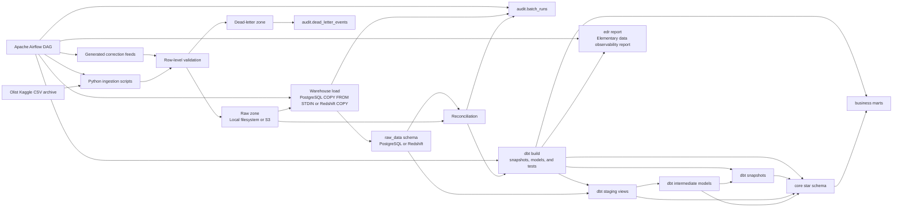
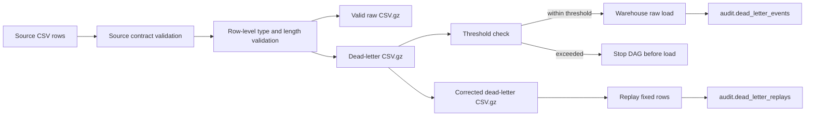
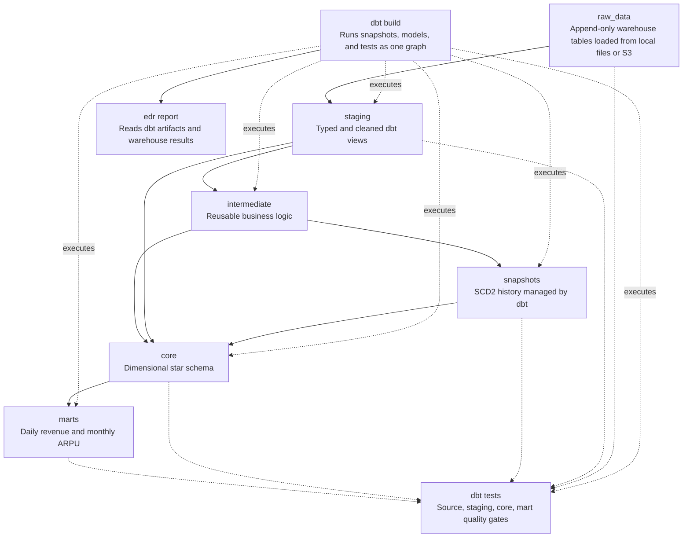
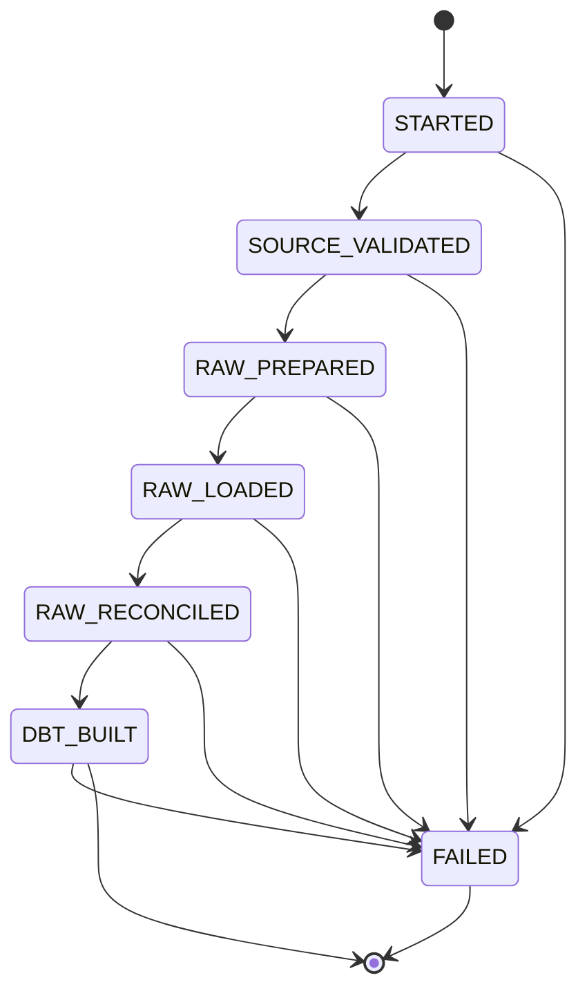
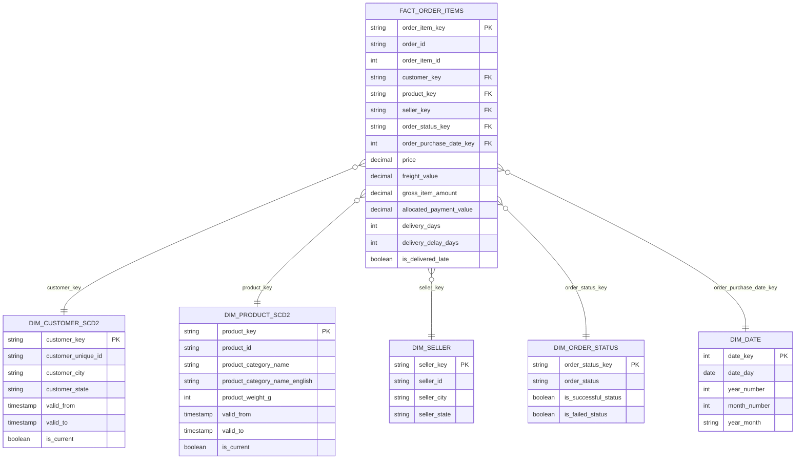
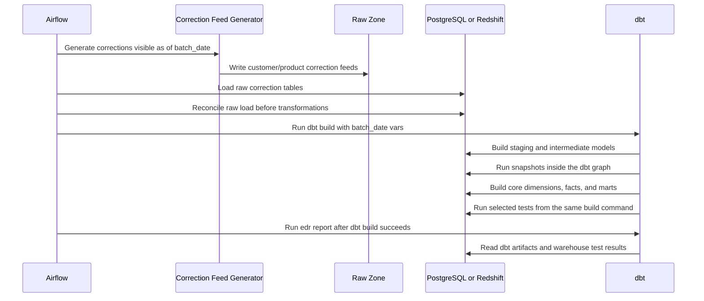

# Diagrams

## End-To-End Architecture

```mermaid
flowchart LR
    source["Olist Kaggle CSV archive"]
    corrections["Generated correction feeds"]
    ingestion["Python ingestion scripts"]
    validation["Row-level validation"]
    rawzone["Raw zone\nLocal filesystem or S3"]
    dlq["Dead-letter zone"]
    copy["Warehouse load\nPostgreSQL COPY FROM STDIN or Redshift COPY"]
    reconcile["Reconciliation"]
    raw["raw_data schema\nPostgreSQL or Redshift"]
    batchcontrol["audit.batch_runs"]
    audit["audit.dead_letter_events"]
    staging["dbt staging views"]
    intermediate["dbt intermediate models"]
    snapshots["dbt snapshots"]
    core["core star schema"]
    marts["business marts"]
    airflow["Apache Airflow DAG"]
    dbtbuild["dbt build\nsnapshots, models, and tests"]
    edr["edr report\nElementary data observability report"]

    airflow --> ingestion
    airflow --> corrections
    airflow --> copy
    airflow --> batchcontrol
    airflow --> dbtbuild
    airflow --> edr

    source --> ingestion
    corrections --> validation
    ingestion --> validation
    validation --> rawzone
    validation --> dlq
    dlq --> audit
    rawzone --> copy
    copy --> raw
    copy --> batchcontrol
    raw --> reconcile
    rawzone --> reconcile
    reconcile --> batchcontrol
    reconcile --> dbtbuild
    dbtbuild --> staging
    dbtbuild --> snapshots
    dbtbuild --> core
    dbtbuild --> marts
    dbtbuild --> edr
    raw --> staging
    staging --> intermediate
    intermediate --> snapshots
    snapshots --> core
    staging --> core
    intermediate --> core
    core --> marts
```

## Dead Letter Flow

```mermaid
flowchart LR
    archive["Source CSV rows"]
    contract["Source contract validation"]
    rowcheck["Row-level type and length validation"]
    valid["Valid raw CSV.gz"]
    rejected["Dead-letter CSV.gz"]
    corrected["Corrected dead-letter CSV.gz"]
    threshold["Threshold check"]
    load["Warehouse raw load"]
    replay["Replay fixed rows"]
    stop["Stop DAG before load"]
    audit["audit.dead_letter_events"]
    replayaudit["audit.dead_letter_replays"]

    archive --> contract
    contract --> rowcheck
    rowcheck --> valid
    rowcheck --> rejected
    rejected --> threshold
    threshold -->|within threshold| load
    threshold -->|exceeded| stop
    load --> audit
    rejected --> corrected
    corrected --> replay
    replay --> replayaudit
```

## Warehouse Layers

```mermaid
flowchart TB
    raw["raw_data\nAppend-only warehouse tables loaded from local files or S3"]
    staging["staging\nTyped and cleaned dbt views"]
    intermediate["intermediate\nReusable business logic"]
    snapshots["snapshots\nSCD2 history managed by dbt"]
    core["core\nDimensional star schema"]
    marts["marts\nDaily revenue and monthly ARPU"]
    build["dbt build\nRuns snapshots, models, and tests as one graph"]
    edr["edr report\nReads dbt artifacts and warehouse results"]
    tests["dbt tests\nSource, staging, core, mart quality gates"]

    build -.->|executes| staging
    build -.->|executes| intermediate
    build -.->|executes| snapshots
    build -.->|executes| core
    build -.->|executes| marts
    build -.->|executes| tests
    build --> edr

    raw --> staging
    staging --> intermediate
    intermediate --> snapshots
    snapshots --> core
    staging --> core
    intermediate --> core
    core --> marts

    raw -.-> tests
    staging -.-> tests
    snapshots -.-> tests
    core -.-> tests
    marts -.-> tests
```

## Batch Control State

```mermaid
stateDiagram-v2
    [*] --> STARTED
    STARTED --> SOURCE_VALIDATED
    SOURCE_VALIDATED --> RAW_PREPARED
    RAW_PREPARED --> RAW_LOADED
    RAW_LOADED --> RAW_RECONCILED
    RAW_RECONCILED --> DBT_BUILT
    STARTED --> FAILED
    SOURCE_VALIDATED --> FAILED
    RAW_PREPARED --> FAILED
    RAW_LOADED --> FAILED
    RAW_RECONCILED --> FAILED
    DBT_BUILT --> FAILED
    DBT_BUILT --> [*]
    FAILED --> [*]
```

## Core Star Schema

```mermaid
erDiagram
    FACT_ORDER_ITEMS {
        string order_item_key PK
        string order_id
        int order_item_id
        string customer_key FK
        string product_key FK
        string seller_key FK
        string order_status_key FK
        int order_purchase_date_key FK
        decimal price
        decimal freight_value
        decimal gross_item_amount
        decimal allocated_payment_value
        int delivery_days
        int delivery_delay_days
        boolean is_delivered_late
    }

    DIM_CUSTOMER_SCD2 {
        string customer_key PK
        string customer_unique_id
        string customer_city
        string customer_state
        timestamp valid_from
        timestamp valid_to
        boolean is_current
    }

    DIM_PRODUCT_SCD2 {
        string product_key PK
        string product_id
        string product_category_name
        string product_category_name_english
        int product_weight_g
        timestamp valid_from
        timestamp valid_to
        boolean is_current
    }

    DIM_SELLER {
        string seller_key PK
        string seller_id
        string seller_city
        string seller_state
    }

    DIM_ORDER_STATUS {
        string order_status_key PK
        string order_status
        boolean is_successful_status
        boolean is_failed_status
    }

    DIM_DATE {
        int date_key PK
        date date_day
        int year_number
        int month_number
        string year_month
    }

    FACT_ORDER_ITEMS }o--|| DIM_CUSTOMER_SCD2 : customer_key
    FACT_ORDER_ITEMS }o--|| DIM_PRODUCT_SCD2 : product_key
    FACT_ORDER_ITEMS }o--|| DIM_SELLER : seller_key
    FACT_ORDER_ITEMS }o--|| DIM_ORDER_STATUS : order_status_key
    FACT_ORDER_ITEMS }o--|| DIM_DATE : order_purchase_date_key
```

## Unified dbt Build And EDR Flow

```mermaid
sequenceDiagram
    participant Airflow
    participant Generator as Correction Feed Generator
    participant RawZone as Raw Zone
    participant Warehouse as PostgreSQL or Redshift
    participant dbt

    Airflow->>Generator: Generate corrections visible as of batch_date
    Generator->>RawZone: Write customer/product correction feeds
    Airflow->>Warehouse: Load raw correction tables
    Airflow->>Warehouse: Reconcile raw load before transformations
    Airflow->>dbt: Run dbt build with batch_date vars
    dbt->>Warehouse: Build staging and intermediate models
    dbt->>Warehouse: Run snapshots inside the dbt graph
    dbt->>Warehouse: Build core dimensions, facts, and marts
    dbt->>Warehouse: Run selected tests from the same build command
    Airflow->>dbt: Run edr report after dbt build succeeds
    dbt->>Warehouse: Read dbt artifacts and warehouse test results
```
