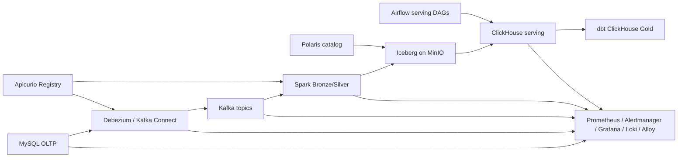
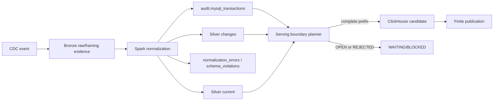
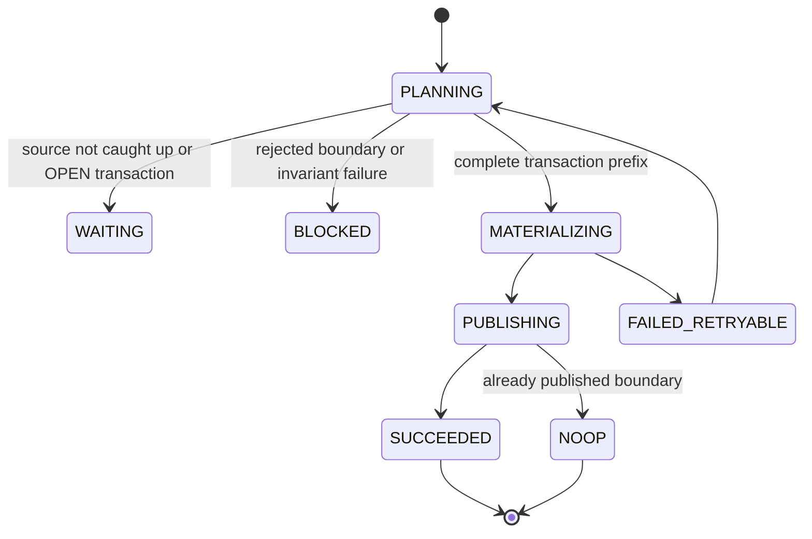
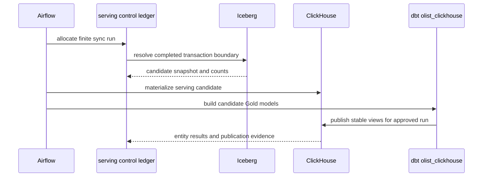

# Target architecture diagrams

## End-to-end data path

## Transaction and rejection boundary

## Serving state machine

## Target dbt publication

Historical phase diagrams remain in the migration records under `docs/cdc/`
and `docs/reports/`; they are not operating instructions for the target stack.
