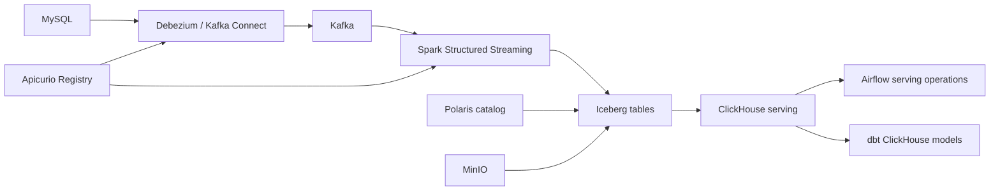
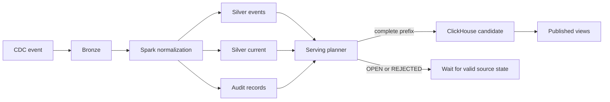
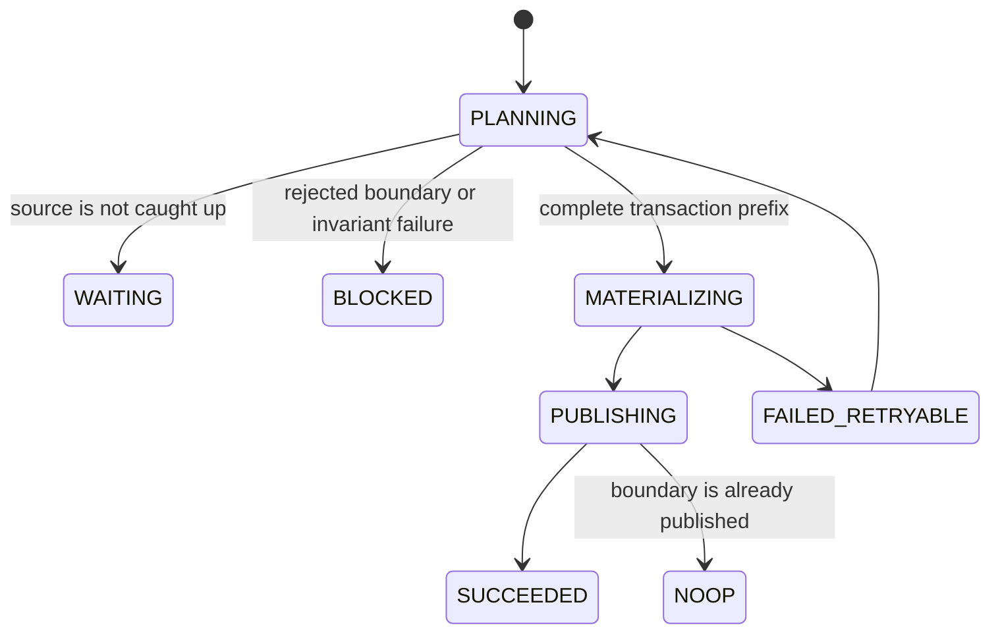
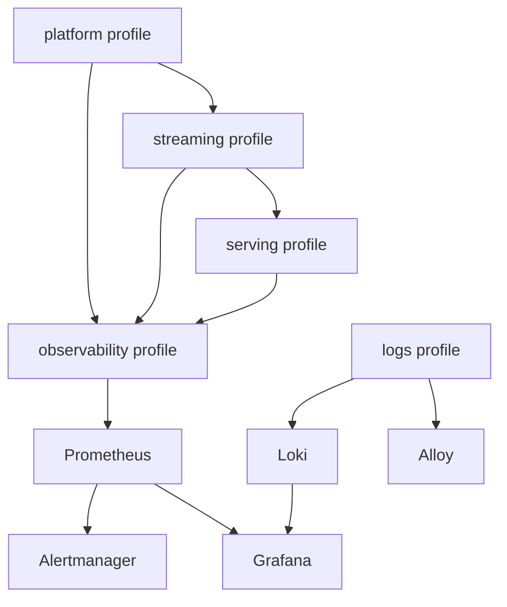

# Local architecture diagrams

## CDC data path

```mermaid
flowchart LR
    mysql["MySQL"] --> connect["Debezium / Kafka Connect"]
    connect --> kafka["Kafka"]
    registry["Apicurio Registry"] --> connect
    registry --> spark["Spark Structured Streaming"]
    kafka --> spark
    spark --> iceberg["Iceberg tables"]
    polaris["Polaris catalog"] --> iceberg
    minio["MinIO"] --> iceberg
    iceberg --> clickhouse["ClickHouse serving"]
    clickhouse --> airflow["Airflow serving operations"]
    clickhouse --> dbt["dbt ClickHouse models"]
```

## Transaction publication boundary

```mermaid
flowchart LR
    event["CDC event"] --> bronze["Bronze"]
    bronze --> normalize["Spark normalization"]
    normalize --> silver_events["Silver events"]
    normalize --> silver_current["Silver current"]
    normalize --> audit["Audit records"]
    silver_events --> planner["Serving planner"]
    silver_current --> planner
    audit --> planner
    planner -->|complete prefix| candidate["ClickHouse candidate"]
    planner -->|OPEN or REJECTED| waiting["Wait for valid source state"]
    candidate --> publish["Published views"]
```

## Serving states

```mermaid
stateDiagram-v2
    [*] --> PLANNING
    PLANNING --> WAITING: source is not caught up
    PLANNING --> BLOCKED: rejected boundary or invariant failure
    PLANNING --> MATERIALIZING: complete transaction prefix
    MATERIALIZING --> PUBLISHING
    PUBLISHING --> SUCCEEDED
    PUBLISHING --> NOOP: boundary is already published
    MATERIALIZING --> FAILED_RETRYABLE
    FAILED_RETRYABLE --> PLANNING
```

## Compose and telemetry

```mermaid
flowchart TB
    platform["platform profile"] --> streaming["streaming profile"]
    streaming --> serving["serving profile"]
    platform --> observability["observability profile"]
    streaming --> observability
    serving --> observability
    observability --> prometheus["Prometheus"]
    prometheus --> alertmanager["Alertmanager"]
    prometheus --> grafana["Grafana"]
    logs["logs profile"] --> loki["Loki"]
    logs --> alloy["Alloy"]
    loki --> grafana
```
