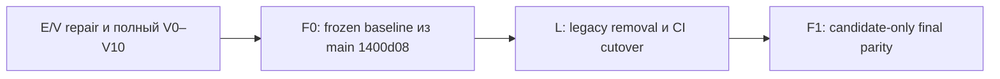

# Координационный план финальных стадий миграции

- **Статус**: `ACTIVE`; E/V и F0 завершены, L0 baseline/inventory complete, L1 pending.
- **Назначение**: задать порядок финальных стадий, точки запрета и ссылки на исполнимые детальные планы.
- **Решение по parity**: legacy запускается один раз до cleanup для формирования frozen baseline; после cleanup выполняется только candidate-only сравнение.

---

## 1. Последовательность

| Стадия | Статус | Результат | Детальный план |
| --- | --- | --- | --- |
| E/V repair | `COMPLETE` | clean V0–V10 `PASS` на commit `e113c552cca990636f426b827456a77ddc9d594b`; raw evidence сохранён | [stage-ev-validation-repair.md](../completed/stage-ev-validation-repair.md) |
| F0 | `COMPLETE` | неизменяемый oracle `main-1400d08.json` (`PASS`, report: [docs/reports/mysql-spark-iceberg-f0-baseline.md](../../../reports/mysql-spark-iceberg-f0-baseline.md)) | [stage-f0-baseline-freeze.md](../completed/stage-f0-baseline-freeze.md) |
| L | `ACTIVE (L1 pending)` | L0 baseline diagnostic/corrective E2E, disposition inventory и target contracts завершены; L1 target repair/tests следующий | [stage-l-legacy-removal-ci-cutover.md](stage-l-legacy-removal-ci-cutover.md) |
| F1 | `PENDING` | `PASS` candidate против frozen oracle | [stage-f1-final-parity.md](stage-f1-final-parity.md) |

Переход через стадию запрещён, пока её критерии завершения не подтверждены evidence. Отчёт с отсутствующими обязательными воротами не считается `PASS`.

Clean E/V acceptance зафиксирован в run `stage_v_clean_e113c55` для Compose project
`olist_stage_v`. Все 11 gate и 42 assertions завершились `PASS`; следующий
разрешённый переход — только F0.

Текущий L0 baseline и inventory зафиксированы в [отчёте L0](../../../reports/lakehouse-stage-l0-baseline.md), [реестре disposition](../contracts/legacy-disposition-register.md), [контракте observability](../contracts/observability.md) и [контракте tests/evidence](../contracts/testing-and-evidence.md).

---

## 2. Почему F разделена на F0 и F1

Текущее feature-дерево уже использует новый Compose/runtime и не является неизменённым legacy-контуром, хотя legacy-файлы ещё присутствуют. Поэтому сравнивать candidate с «legacy из текущей ветки» нельзя.

Воспроизводимый источник legacy — точный Git commit `1400d08345ad81a0121f0ee85ee9ae81cd575a73`, совпадающий с `main` на момент принятия решения. Git worktree позволяет запустить его независимо от последующего удаления файлов.

Оптимальный по времени порядок:

1. один раз поднять этот commit и экспортировать канонический baseline (F0);
2. удалить legacy и заменить CI (L);
3. поднять только candidate и сравнить с сохранённым baseline (F1).

Итоговая проверка остаётся после cleanup и тем самым проверяет конечное дерево, но больше не требует сборки legacy на каждом повторе.

---

## 3. Контрольные точки

### Gate EV → F0

- устранены пробелы Stage E runtime и Stage V harness;
- raw evidence содержит все V0–V10;
- все ворота имеют фактический `PASS`;
- отчёты построены из evidence, а не из декларативных значений.

### Gate F0 → L

- baseline привязан к полному commit SHA и fixture SHA-256;
- oracle покрывает 8 current-state сущностей, fact и 2 marts;
- канонические строки и metadata прошли независимую проверку;
- legacy Compose domain и worktree очищены.

### Gate L → F1

- legacy runtime/tests/workflows удалены согласно inventory;
- общий CI зелёный;
- релевантные bounded component workflows зелёные;
- ручной acceptance workflow прошёл preflight;
- F0 oracle и reader не удалены.

### Gate F1 → Complete

- отсутствующие/лишние ключи: `0`;
- расхождения бизнес-колонок: `0`;
- отчёт и raw diff согласованы и имеют `PASS`;
- evidence привязан к точным baseline/candidate SHA.

---

## 4. Политика CI на финальных стадиях

| Уровень | Workflow | Запуск | Назначение |
| --- | --- | --- | --- |
| Обязательный PR CI | `.github/workflows/ci.yml` | `pull_request`, `push main` | быстрые static/unit/contract проверки всех target-компонентов |
| Bounded integration | `.github/workflows/lakehouse-components.yml` | автоматически по path filters; также `workflow_dispatch` | Spark image, CDC, serving и Airflow runtime на малом fixture |
| Полная приёмка | `.github/workflows/lakehouse-acceptance.yml` | только `workflow_dispatch` | полный V0–V10 и/или F1 на выделенном runner |
| Baseline generation | не является регулярным workflow | одноразовый контролируемый F0 | frozen oracle; автоматическая регенерация запрещена |

Полная job/workflow матрица, судьба каждого старого job и порядок замены без слепой зоны определены в [плане Stage L](stage-l-legacy-removal-ci-cutover.md).

---

## 5. Правила изменения порядка

- Stage L нельзя начинать до принятия F0.
- F0 нельзя использовать для сокрытия дефекта candidate: baseline строится только из зафиксированного legacy commit.
- F1 не регенерирует oracle и не запускает legacy.
- Ошибка F1 возвращает работу в candidate implementation/L cleanup, но не меняет F0 без отдельного решения.
- Исторические reports не удаляются; их статус и ограничения должны быть явно обозначены.

---

## 6. Связанные контракты и отчёты

- [Дорожная карта миграции](../../mysql-spark-iceberg-lakehouse-migration.md)
- [Контракт Validation & CI](../contracts/validation-and-ci.md)
- [Контракт финального паритета](../contracts/final-parity.md)
- [Контракт serving и recovery](../contracts/serving-and-recovery.md)
- [Исторический отчёт Stage E](../../../reports/mysql-spark-iceberg-stage-e-validation.md)
- [Исторический отчёт Stage V](../../../reports/mysql-spark-iceberg-stage-v-validation.md)
