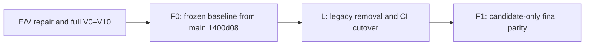

# Coordination Plan for the Final Migration Stages

- **Status**: `ACTIVE`; E/V, F0 and Stage L are complete; F1 is pending.
- **Purpose**: define the order of the final stages, blocking points and links to executable detailed plans.
- **Parity decision**: run legacy once before cleanup to create the frozen baseline; after cleanup, perform only a candidate-only comparison.

---

## 1. Sequence

| Stage | Status | Result | Detailed plan |
| --- | --- | --- | --- |
| E/V repair | `COMPLETE` | clean V0–V10 `PASS` on commit `e113c552cca990636f426b827456a77ddc9d594b`; raw evidence retained | [stage-ev-validation-repair.md](../completed/stage-ev-validation-repair.md) |
| F0 | `COMPLETE` | immutable `main-1400d08.json` oracle (`PASS`, report: [docs/reports/mysql-spark-iceberg-f0-baseline.md](../../../reports/mysql-spark-iceberg-f0-baseline.md)) | [stage-f0-baseline-freeze.md](../completed/stage-f0-baseline-freeze.md) |
| L | `COMPLETE` | L0 inventory, L1 target repair, L2 observability, L3 CI cutover and L4 legacy removal passed; clean Stage V acceptance is recorded | [stage-l-legacy-removal-ci-cutover.md](../completed/stage-l-legacy-removal-ci-cutover.md) |
| F1 | `PENDING` | `PASS` candidate against frozen oracle | [stage-f1-final-parity.md](stage-f1-final-parity.md) |

Progression through a stage is forbidden until its completion criteria are confirmed by evidence. A report with missing mandatory gates is not `PASS`.

Clean E/V acceptance is recorded in run `stage_v_clean_e113c55` for Compose project
`olist_stage_v`. All 11 gates and 42 assertions finished `PASS`; the next
permitted transition was F0.

The L0 baseline and inventory are recorded in the [L0 report](../../../reports/lakehouse-stage-l0-baseline.md), [disposition register](../contracts/legacy-disposition-register.md), [observability contract](../contracts/observability.md) and [tests/evidence contract](../contracts/testing-and-evidence.md).

The CI-only L3 result is recorded in the [L3 report](../../../reports/lakehouse-stage-l3.md). The full Stage V E2E was not run for that substage because the changes did not affect the runtime execution path; manual acceptance remained a separate gate and was later completed in L4.

---

## 2. Why F is split into F0 and F1

The current feature tree already uses the new Compose/runtime and is not an unchanged legacy contour, even though legacy files were still present. Therefore the candidate cannot be compared with “legacy from the current branch.”

The reproducible legacy source is the exact Git commit `1400d08345ad81a0121f0ee85ee9ae81cd575a73`, which matched `main` when the decision was made. A Git worktree allows it to run independently of the later file deletions.

The time-efficient order is:

1. start this commit once and export the canonical baseline (F0);
2. remove legacy and replace CI (L);
3. start only the candidate and compare it with the saved baseline (F1).

The final check remains after cleanup and therefore validates the final tree, but no longer requires rebuilding legacy on every retry.

---

## 3. Control points

### Gate EV → F0

- Stage E runtime and Stage V harness gaps are resolved;
- raw evidence contains all V0–V10 gates;
- every gate has an actual `PASS`;
- reports are built from evidence, not declarative values.

### Gate F0 → L

- the baseline is tied to the full commit SHA and fixture SHA-256;
- the oracle covers eight current-state entities, the fact and two marts;
- canonical rows and metadata passed independent validation;
- the legacy Compose domain and worktree are clean.

### Gate L → F1

- legacy runtime/tests/workflows are removed according to the inventory;
- common CI is green;
- relevant bounded component workflows are green;
- the manual acceptance workflow passed preflight;
- the F0 oracle and reader are retained.

### Gate F1 → Complete

- missing/extra keys: `0`;
- business-column mismatches: `0`;
- the report and raw diff agree and have `PASS`;
- evidence is tied to exact baseline/candidate SHAs.

---

## 4. CI policy for the final stages

| Level | Workflow | Trigger | Purpose |
| --- | --- | --- | --- |
| Required PR CI | `.github/workflows/ci.yml` | `pull_request`, `push main` | fast static/unit/contract checks for all target components |
| Bounded component contracts | `.github/workflows/lakehouse-components.yml` | automatic path filters | fast Spark image, Airflow and observability contract checks |
| Bounded CDC runtime | `.github/workflows/lakehouse-cdc.yml` | `workflow_dispatch` only | MySQL → Debezium → Kafka/Apicurio → Spark catch-up/restart on the small fixture |
| Bounded serving runtime | `.github/workflows/lakehouse-serving.yml` | `workflow_dispatch` only | finite serving sync, no-op retry, rebuild and maintenance on the small fixture |
| Full acceptance | `.github/workflows/lakehouse-acceptance.yml` | `workflow_dispatch` only | full V0–V10 and/or F1 on a dedicated runner |
| Baseline generation | not a regular workflow | one controlled F0 run | frozen oracle; automatic regeneration forbidden |

The complete job/workflow matrix, the disposition of every old job and the replacement order are defined in the [Stage L plan](../completed/stage-l-legacy-removal-ci-cutover.md).

---

## 5. Rules for changing the order

- Do not start Stage L before F0 is accepted.
- Do not use F0 to hide a candidate defect: build the baseline only from the frozen legacy commit.
- F1 does not regenerate the oracle or start legacy.
- An F1 failure returns work to candidate implementation/L cleanup, but does not change F0 without a separate decision.
- Do not delete historical reports; explicitly label their status and limitations.

---

## 6. Related contracts and reports

- [Migration roadmap](../../mysql-spark-iceberg-lakehouse-migration.md)
- [Validation and CI contract](../contracts/validation-and-ci.md)
- [Final parity contract](../contracts/final-parity.md)
- [Serving and recovery contract](../contracts/serving-and-recovery.md)
- [Historical Stage E report](../../../reports/mysql-spark-iceberg-stage-e-validation.md)
- [Historical Stage V report](../../../reports/mysql-spark-iceberg-stage-v-validation.md)
