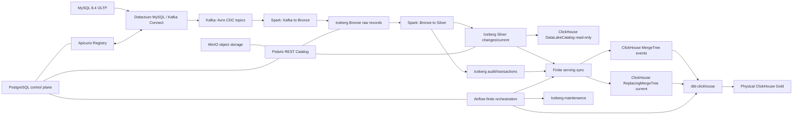

# Technical Contract: Architecture, Version Stack and Runtime Lifecycle

- **Status**: Active normative contract
- **Purpose**: Define the target architecture, technology stack, Git/agent collaboration principles and CLI lifecycle.
- **Authority**: Defines the current requirements for system architecture and runtime environments.

---

## 1. Target architecture and system invariants

### 1.1 Architecture chain

The local migration stack is built as follows:

```text
MySQL OLTP
  → Debezium MySQL (Kafka Connect)
  → Kafka + Apicurio Registry (Confluent-framed Avro)
  → Spark Structured Streaming (Scala runtime)
  → Apache Iceberg on MinIO through the Polaris REST Catalog
      ├── Bronze raw Kafka records
      ├── Silver typed changes
      ├── Silver current state
      ├── transaction/audit tables
      └── immutable reference data
  → finite ClickHouse serving sync
  → native ClickHouse MergeTree/ReplacingMergeTree
  → separate dbt-clickhouse project
  → physical ClickHouse Gold
```



### 1.2 Durability path

The guaranteed data-persistence chain (durability path) ends in Iceberg:

```text
MySQL → Debezium → Kafka → Spark → Iceberg
```

Airflow and ClickHouse are **not** part of the durability path. If they stop or fail, CDC transport and processing from MySQL to Iceberg continues. After recovery, the serving layer reads the accumulated Iceberg Silver event ledger.

### 1.3 Layer authority

| Layer | Responsibility |
| --- | --- |
| MySQL | The only authoritative OLTP business source |
| Kafka | Bounded-retention transport and replay buffer |
| Apicurio | Wire schemas, schema IDs and compatibility rules |
| Iceberg Bronze | Immutable Kafka key/value bytes and transport metadata |
| Iceberg Silver changes | Canonical normalized CDC event ledger |
| Iceberg Silver current | Canonical current entity state |
| Iceberg audit/reference | Transactions, errors, progress, geolocation |
| ClickHouse native CDC | Fully rebuildable serving copy |
| ClickHouse Gold | Physical local analytical models |
| PostgreSQL control plane | Airflow, Polaris, Apicurio and serving-run metadata only |

---

## 2. Pinned technology versions

The system must use the following technology versions:

| Component | Version / Specification |
| --- | --- |
| MySQL | `mysql:8.4.10` |
| MySQL Connector/Python | `9.7.0` |
| MySQL Connector/J | `9.7.0` |
| PostgreSQL control plane | `postgres:17.10` |
| Kafka | `apache/kafka:4.3.1` |
| Debezium | `3.6.0.Final` |
| Apicurio Registry | `3.3.0` |
| Spark runtime | `4.1.3`, Scala `2.13.17`, Java `17.0.19` |
| Spark application language | Scala `2.13.17` for the entire Wave 2 data plane |
| Spark build | sbt `1.12.11`, Scalafmt `3.11.5`, sbt-scalafmt `2.6.2` |
| Spark tests | ScalaTest `3.2.19` |
| Python | `3.12`, control plane and J1 Iceberg migration only |
| Iceberg | `1.11.0` |
| Polaris | `1.6.0` |
| ClickHouse | `26.3.17.4` |
| Airflow | `3.2.1` |
| dbt-clickhouse | `1.10.1` |
| MinIO | Existing pinned project image (`RELEASE.2025-10-15T17-29-55Z`); `latest` is forbidden |

Required Spark runtime artifacts:

```text
org.apache.iceberg:iceberg-spark-runtime-4.1_2.13:1.11.0
org.apache.iceberg:iceberg-aws-bundle:1.11.0
org.apache.spark:spark-sql-kafka-0-10_2.13:4.1.3
org.apache.spark:spark-avro_2.13:4.1.3
com.mysql:mysql-connector-j:9.7.0
```

`iceberg-aws-bundle`, S3A and `s3://`/`s3a://` identifiers here are the
S3-compatible adapter used by the local MinIO object store. They do not mean
that AWS or Redshift is a supported cloud target. AWS cloud services,
Redshift-specific runtime code, credentials and infrastructure are removed by
Stage L; the future Google Cloud stack is specified separately.

---

## 3. Collaboration and shared-access rules (Git Rules)

### 3.1 Implementation branch

The complete implementation is maintained in the branch:

```text
feature/mysql-spark-iceberg
```

Baseline commit for the current architecture: `1400d08345ad81a0121f0ee85ee9ae81cd575a73e`.

### 3.2 Shared-file rule

Changes to the shared system composition are restricted by the shared-access rule. Before the join point, only the integration agent may change:

```text
compose.yaml
pyproject.toml
uv.lock
scripts/cdc/local_lab.py
README.md
docs/architecture.md
```

### 3.3 Parallel-development restrictions

Do not assign the following simultaneously to multiple autonomous agents:
- `compose.yaml`;
- shared Spark Scala modules (`com.olist.mds.spark.normalize`, `contract`, `iceberg`);
- Airflow DAGs and their PostgreSQL control schema;
- dbt project configuration and schema-generation macros;
- the final parity runner and canonical comparator;
- bulk deletion of legacy paths.

---

## 4. Runtime and lifecycle contract

### 4.1 Compose profiles

Fixed `container_name` values are removed to prevent name conflicts between runs.

The system uses the following profiles:
- `platform`: control PostgreSQL, MySQL, Kafka, topic bootstrap, Apicurio, Kafka Connect, MinIO, Polaris, Spark master/worker and the one-shot geolocation loader;
- `streaming`: Bronze/Silver Spark drivers (`spark-bronze`, `spark-silver`) and one-shot replay/status operations;
- `serving`: ClickHouse and Airflow;
- `observability`: exporters, Prometheus, Grafana, Loki.

The dependency order is strictly one-way:

```text
streaming → platform
serving → platform
observability → observed services
```

No `platform` service or platform lifecycle command depends on `serving` or `observability`. The `platform` profile does not start ClickHouse/Airflow.

Compose service inventory:
`platform-postgres`, `mysql`, `kafka`, `kafka-topics`, `apicurio-registry`, `kafka-connect`, `minio`, `minio-init`, `polaris`, `polaris-bootstrap`, `spark-master`, `spark-worker`, `spark-bronze`, `spark-silver`, `spark-geolocation`, `spark-ops`, `clickhouse`, `clickhouse-init`, `airflow`.

### 4.2 Unified CLI interface (`local_lab.py`)

The local environment is managed exclusively through `scripts/cdc/local_lab.py`:

```powershell
python scripts/cdc/local_lab.py doctor
python scripts/cdc/local_lab.py reset --yes
python scripts/cdc/local_lab.py bootstrap --archive tests/fixtures/olist_small/olist_small.zip
python scripts/cdc/local_lab.py up
python scripts/cdc/local_lab.py down
python scripts/cdc/local_lab.py seed --archive tests/fixtures/olist_small/olist_small.zip --run-id <id> --random-seed <n>
python scripts/cdc/local_lab.py start-streaming
python scripts/cdc/local_lab.py start-serving [--build] [--timeout <seconds>]
python scripts/cdc/local_lab.py wait-caught-up --timeout <seconds>
python scripts/cdc/local_lab.py sync-serving
python scripts/cdc/local_lab.py rebuild-serving --yes
python scripts/cdc/local_lab.py run-maintenance
python scripts/cdc/local_lab.py status [--require platform|streaming|serving]
python scripts/cdc/local_lab.py validate [--scope platform|streaming|serving] [--timeout <seconds>]
python scripts/cdc/local_lab.py validate-serving --sync-run-seq <seq> --sync-run-id <id>
python scripts/cdc/local_lab.py final-parity --confirm-destructive
```

### 4.3 CLI command requirements

- `reset --yes` runs exactly `docker compose down -v --remove-orphans`. Deleting local host directories is forbidden.
- `bootstrap` checks domain cleanliness, starts `platform`, creates tables/catalogs, seeds MySQL, loads geolocation and registers the connector.
- `bootstrap` and `up` pass only `--profile platform` to Compose.
- `start-streaming` requires `platform` readiness, then starts `--profile platform --profile streaming`.
- `start-serving` starts `--profile platform --profile serving` and waits for healthy `clickhouse`/`airflow` and successful serving one-shot dependencies.
- `sync-serving`, `rebuild-serving` and `run-maintenance` are allowed only after the serving profile is ready and launch DAGs manually.
- Serving, quality, maintenance and rebuild DAGs use `schedule=None` and run only manually; this prevents scheduler races without toggling pause during validation.
- `status` and `validate` check the real state of running services and the metadata inventory.
- All commands use timeouts, redact secrets and return JSON results.

---

## 5. Disposable state policy

The consistency domain includes:
- MySQL;
- Kafka and Kafka Connect state;
- Apicurio Registry state;
- MinIO/Iceberg objects;
- Polaris metadata;
- Spark checkpoints;
- ClickHouse state;
- Airflow / control PostgreSQL.

All Docker volumes are fully disposable. Loss or corruption of any of these volumes (except ClickHouse) requires `reset --yes` followed by `bootstrap`. Partial repair is not allowed. ClickHouse is a derived layer and is restored through `rebuild-serving`.

---

## 6. Configuration interface (Environment Variables)

Applications read configuration exclusively through standardized environment variables:

`MYSQL_HOST`, `MYSQL_PORT`, `MYSQL_DATABASE`, `KAFKA_BOOTSTRAP_SERVERS`, `APICURIO_REGISTRY_URL`, `APICURIO_CCOMPAT_URL`, `ICEBERG_CATALOG_URI`, `ICEBERG_CATALOG_NAME`, `ICEBERG_WAREHOUSE`, `OBJECT_STORE_ENDPOINT`, `OBJECT_STORE_REGION`, `OBJECT_STORE_PATH_STYLE`, `OBJECT_STORE_CREDENTIAL_PROVIDER`, `SPARK_CHECKPOINT_ROOT`, `SPARK_CONTRACT_VERSION`, `SPARK_STATUS_DIR`, `SPARK_RUNTIME_MODE`, `MYSQL_REFERENCE_READER_USERNAME`, `MYSQL_REFERENCE_READER_PASSWORD_FILE`, `CLICKHOUSE_HOST`, `CLICKHOUSE_PORT`, `DBT_PROJECT_DIR`, `DBT_TARGET`.

Passwords and tokens are passed to containers only through secret files (`*_FILE`). Plaintext passwords in the environment, logs or reports are forbidden.

---

## 7. Related documents

- [Migration roadmap](../../mysql-spark-iceberg-lakehouse-migration.md)
- [MySQL, Kafka and Avro contract](mysql-kafka-avro.md)
- [Iceberg data model contract](iceberg-data-model.md)
- [Spark Structured Streaming contract](spark-streaming.md)
- [Serving and recovery contract](serving-and-recovery.md)
- [Validation and CI contract](validation-and-ci.md)
- [Final parity contract](final-parity.md)
