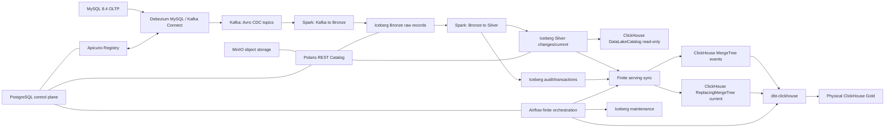

# Технический контракт: Архитектура, стек версий и жизненный цикл (Runtime)

- **Статус**: Действующий нормативный контракт (Active normative contract)
- **Назначение**: Фиксация целевой архитектуры, технологического стека, принципов организации Git/агентов и lifecycle CLI.
- **Порядок авторитетности**: Определяет действующие требования к системной архитектуре и средам выполнения.

---

## 1. Целевая архитектура и системные инварианты

### 1.1 Архитектурная цепочка

Локальный контур миграции построен по следующей схеме:

```text
MySQL OLTP
  → Debezium MySQL (Kafka Connect)
  → Kafka + Apicurio Registry (Confluent-framed Avro)
  → Spark Structured Streaming (Scala runtime)
  → Apache Iceberg на MinIO через Polaris REST Catalog
      ├── Bronze raw Kafka records
      ├── Silver typed changes
      ├── Silver current state
      ├── transaction/audit tables
      └── immutable reference data
  → finite ClickHouse serving sync
  → native ClickHouse MergeTree/ReplacingMergeTree
  → отдельный dbt-clickhouse project
  → физический ClickHouse Gold
```



### 1.2 Цепочка надежности (Durability Path)

Цепочка гарантированной сохранности данных (durability path) заканчивается в Iceberg:

```text
MySQL → Debezium → Kafka → Spark → Iceberg
```

Airflow и ClickHouse **не входят** в durability path. При их остановке или сбое транспортировка и обработка CDC-событий из MySQL в Iceberg продолжается. После восстановления serving-слой считывает накопленный Iceberg Silver event ledger.

### 1.3 Авторитетность слоёв

| Слой | Ответственность |
| --- | --- |
| MySQL | Единственный authoritative OLTP источник бизнеса |
| Kafka | Ограниченный retention transport и replay buffer |
| Apicurio | Wire schemas, schema IDs и compatibility rules |
| Iceberg Bronze | Неизменённые Kafka key/value bytes и transport metadata |
| Iceberg Silver changes | Канонический нормализованный CDC event ledger |
| Iceberg Silver current | Каноническое текущее состояние entities |
| Iceberg audit/reference | Transactions, errors, progress, geolocation |
| ClickHouse native CDC | Полностью перестраиваемая serving-копия |
| ClickHouse Gold | Физические локальные аналитические модели |
| PostgreSQL control plane | Только Airflow, Polaris, Apicurio и serving-run metadata |

---

## 2. Зафиксированные технологические версии

Система обязана использовать следующие технологические версии:

| Компонент | Версия / Спецификация |
| --- | --- |
| MySQL | `mysql:8.4.10` |
| MySQL Connector/Python | `9.7.0` |
| MySQL Connector/J | `9.7.0` |
| PostgreSQL control plane | `postgres:17.10` |
| Kafka | `apache/kafka:4.3.1` |
| Debezium | `3.6.0.Final` |
| Apicurio Registry | `3.3.0` |
| Spark runtime | `4.1.3`, Scala `2.13.17`, Java `17.0.19` |
| Spark application language | Scala `2.13.17` для всего Wave 2 data plane |
| Spark build | sbt `1.12.11`, Scalafmt `3.11.5`, sbt-scalafmt `2.6.2` |
| Spark tests | ScalaTest `3.2.19` |
| Python | `3.12`, только control plane и J1 Iceberg migration |
| Iceberg | `1.11.0` |
| Polaris | `1.6.0` |
| ClickHouse | `26.3.17.4` |
| Airflow | `3.2.1` |
| dbt-clickhouse | `1.10.1` |
| MinIO | Существующий pinned image проекта (`RELEASE.2025-10-15T17-29-55Z`); `latest` запрещён |

Обязательные runtime-артефакты Spark:

```text
org.apache.iceberg:iceberg-spark-runtime-4.1_2.13:1.11.0
org.apache.iceberg:iceberg-aws-bundle:1.11.0
org.apache.spark:spark-sql-kafka-0-10_2.13:4.1.3
org.apache.spark:spark-avro_2.13:4.1.3
com.mysql:mysql-connector-j:9.7.0
```

---

## 3. Организация работы и правила совместного доступа (Git Rules)

### 3.1 Ветка реализации

Вся итоговая реализация находится в ветке:

```text
feature/mysql-spark-iceberg
```

Базовый commit текущей архитектуры: `1400d08345ad81a0121f0ee85ee9ae81cd575a73e`.

### 3.2 Shared-file rule

Изменение общего системного состава ограничено правилом совместного доступа. До join-точки только агент интеграции имеет право вносить изменения в:

```text
compose.yaml
pyproject.toml
uv.lock
scripts/cdc/local_lab.py
README.md
docs/architecture.md
```

### 3.3 Ограничения параллельной разработки

Запрещено одновременно назначать нескольким автономным агентам:
- `compose.yaml`;
- общие Scala-модули Spark (`com.olist.mds.spark.normalize`, `contract`, `iceberg`);
- Airflow DAG и его PostgreSQL control schema;
- конфигурацию dbt-проекта и макросы генерации схем;
- final parity runner и canonical comparator;
- массовое удаление legacy paths.

---

## 4. Runtime и lifecycle contract

### 4.1 Compose profiles

Фиксированные `container_name` удалены для предотвращения конфликтов имён при запусках.

В системе используются следующие профили (profiles):
- `platform`: control PostgreSQL, MySQL, Kafka, topic bootstrap, Apicurio, Kafka Connect, MinIO, Polaris, Spark master/worker и one-shot geolocation loader;
- `streaming`: Bronze/Silver Spark drivers (`spark-bronze`, `spark-silver`) и one-shot replay/status ops;
- `serving`: ClickHouse и Airflow;
- `observability`: exporters, Prometheus, Grafana, Loki.

Порядок зависимостей строго однонаправленный:

```text
streaming → platform
serving → platform
observability → наблюдаемые services
```

Ни один сервис профиля `platform` и ни одна команда жизненного цикла платформы не зависят от `serving` или `observability`. Профиль `platform` не запускает ClickHouse/Airflow.

Список сервисов Compose:
`platform-postgres`, `mysql`, `kafka`, `kafka-topics`, `apicurio-registry`, `kafka-connect`, `minio`, `minio-init`, `polaris`, `polaris-bootstrap`, `spark-master`, `spark-worker`, `spark-bronze`, `spark-silver`, `spark-geolocation`, `spark-ops`, `clickhouse`, `clickhouse-init`, `airflow`.

### 4.2 Единый CLI интерфейс (`local_lab.py`)

Управление локальным стендом осуществляется строго через `scripts/cdc/local_lab.py`:

```powershell
python scripts/cdc/local_lab.py doctor
python scripts/cdc/local_lab.py reset --yes
python scripts/cdc/local_lab.py bootstrap --archive tests/fixtures/olist_small/olist_small.zip
python scripts/cdc/local_lab.py up
python scripts/cdc/local_lab.py down
python scripts/cdc/local_lab.py seed --archive tests/fixtures/olist_small/olist_small.zip --run-id <id> --random-seed <n>
python scripts/cdc/local_lab.py start-streaming
python scripts/cdc/local_lab.py start-serving [--build] [--timeout <seconds>]
python scripts/cdc/local_lab.py wait-caught-up --timeout <seconds>
python scripts/cdc/local_lab.py sync-serving
python scripts/cdc/local_lab.py rebuild-serving --yes
python scripts/cdc/local_lab.py run-maintenance
python scripts/cdc/local_lab.py status [--require platform|streaming|serving]
python scripts/cdc/local_lab.py validate [--scope platform|streaming|serving] [--timeout <seconds>]
python scripts/cdc/local_lab.py validate-serving --sync-run-seq <seq> --sync-run-id <id>
python scripts/cdc/local_lab.py final-parity --confirm-destructive
```

### 4.3 Требования к командам CLI

- `reset --yes` выполняет строго `docker compose down -v --remove-orphans`. Удаление локальных каталогов хоста запрещено.
- `bootstrap` проверяет чистоту домена, запускает `platform`, создаёт таблицы/каталоги, выполняет seed в MySQL, загружает geolocation и регистрирует коннектор.
- `bootstrap` и `up` передают в Compose строго `--profile platform`.
- `start-streaming` требует готовности `platform`, затем запускает `--profile platform --profile streaming`.
- `start-serving` запускает `--profile platform --profile serving` и ждёт healthy `clickhouse`/`airflow` и успешного завершения serving one-shot-зависимостей.
- `sync-serving`, `rebuild-serving` и `run-maintenance` разрешены только после готовности serving-профиля и запускают DAG вручную.
- Serving, quality, maintenance and rebuild DAGs имеют `schedule=None` и запускаются только вручную; это исключает scheduler race без переключения pause во время validation.
- `status` и `validate` проверяют реальное состояние запущенных сервисов и инвентаря метаданных.
- Все команды используют таймауты, маскируют секреты и возвращают результат в формате JSON.

---

## 5. Политика одноразового состояния (Disposable State Policy)

В единый домен согласованности (consistency domain) входят:
- MySQL;
- Состояние Kafka и Kafka Connect;
- Состояние Apicurio Registry;
- Объекты MinIO / Iceberg;
- Метаданные Polaris;
- Чекпоинты Spark;
- Состояние ClickHouse;
- Airflow / control PostgreSQL.

Все Docker volumes являются полностью взаимозаменяемыми (disposable). Потеря или повреждение любого из этих volumes (за исключением ClickHouse) требует выполнения `reset --yes` и повторного `bootstrap`. Частичный ремонт не допускается. ClickHouse является производным слоем и восстанавливается через `rebuild-serving`.

---

## 6. Конфигурационный интерфейс (Environment Variables)

Приложения считывают конфигурацию исключительно через стандартизованные переменные окружения:

`MYSQL_HOST`, `MYSQL_PORT`, `MYSQL_DATABASE`, `KAFKA_BOOTSTRAP_SERVERS`, `APICURIO_REGISTRY_URL`, `APICURIO_CCOMPAT_URL`, `ICEBERG_CATALOG_URI`, `ICEBERG_CATALOG_NAME`, `ICEBERG_WAREHOUSE`, `OBJECT_STORE_ENDPOINT`, `OBJECT_STORE_REGION`, `OBJECT_STORE_PATH_STYLE`, `OBJECT_STORE_CREDENTIAL_PROVIDER`, `SPARK_CHECKPOINT_ROOT`, `SPARK_CONTRACT_VERSION`, `SPARK_STATUS_DIR`, `SPARK_RUNTIME_MODE`, `MYSQL_REFERENCE_READER_USERNAME`, `MYSQL_REFERENCE_READER_PASSWORD_FILE`, `CLICKHOUSE_HOST`, `CLICKHOUSE_PORT`, `DBT_PROJECT_DIR`, `DBT_TARGET`.

Передача паролей и токенов в контейнеры производится только через файлы секретов (`*_FILE`). Передача открытых паролей в окружении, логах или отчетах запрещена.

---

## 7. Связанные документы

- [Дорожная карта миграции (Roadmap)](../../mysql-spark-iceberg-lakehouse-migration.md)
- [Контракт MySQL, Kafka и Avro](mysql-kafka-avro.md)
- [Контракт модели данных Iceberg](iceberg-data-model.md)
- [Контракт Spark Structured Streaming](spark-streaming.md)
- [Контракт Serving layer и восстановления](serving-and-recovery.md)
- [Контракт валидации и CI](validation-and-ci.md)
- [Контракт итогового паритета](final-parity.md)
