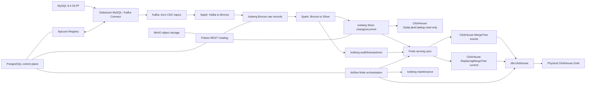

# Olist MDS: прямая миграция на MySQL, Spark Structured Streaming и Apache Iceberg

## 0. Управление документом

| Поле | Значение |
| --- | --- |
| Статус | Wave 1/J1, Wave 2/J2 и Stage E/V revalidation завершены; следующая стадия — F0 |
| Последнее обновление | 2026-08-03 |
| Аудированный commit candidate | `e113c552cca990636f426b827456a77ddc9d594b` |
| Frozen baseline source | `main` commit `1400d08345ad81a0121f0ee85ee9ae81cd575a73` (фиксируется на Stage F0) |
| Ветка реализации | `feature/mysql-spark-iceberg` |
| Evidence J1 | [docs/reports/mysql-spark-iceberg-wave1-j1-validation.md](../reports/mysql-spark-iceberg-wave1-j1-validation.md) |
| Evidence J2 | [docs/reports/mysql-spark-iceberg-wave2-j2-validation.md](../reports/mysql-spark-iceberg-wave2-j2-validation.md) |
| Evidence Stage E | [docs/reports/mysql-spark-iceberg-stage-e-validation.md](../reports/mysql-spark-iceberg-stage-e-validation.md) |
| Evidence Stage V | [docs/reports/mysql-spark-iceberg-stage-v-validation.md](../reports/mysql-spark-iceberg-stage-v-validation.md) |
| Основная аудитория | ИИ-агенты реализации и maintainers |
| Финальный fixture | `tests/fixtures/olist_small/olist_small.zip` |
| SHA-256 fixture | `5cf2ff7a104cae75d8a56cf8c6e00959894154a8d55aed2ddf0e3fa133a13976` |
| Cloud deployment | Вне локальной программы (см. [Deferred GCP plan](gcp-spark-iceberg-bigquery-migration.md)) |

---

## 1. Цель и целевая архитектура

Миграция заменяет исходный контур PostgreSQL/NiFi/ClickHouse на современный локальный Lakehouse-стек:

```text
MySQL OLTP
  → Debezium MySQL / Kafka Connect
  → Kafka + Apicurio Registry (Confluent-framed Avro)
  → Spark Structured Streaming (Scala data plane)
  → Apache Iceberg на MinIO через Polaris REST Catalog
      ├── Bronze raw Kafka records
      ├── Silver typed changes & current state
      ├── transaction & audit tables
      └── immutable reference data
  → finite ClickHouse serving sync
  → native ClickHouse MergeTree/ReplacingMergeTree
  → отдельный dbt-clickhouse project (Gold)
```



---

## 2. Системные инварианты

- **MySQL** — единственная авторитетная OLTP СУБД источника данных бизнеса.
- **Kafka** — ограниченный по времени хранения буфер транспортировки и повтора (retention 7 дней).
- **Iceberg** — каноническое хранилище слоев Bronze, Silver, аудита и справочников.
- **ClickHouse** — полностью перестраиваемый слой витрин (serving layer).
- **PostgreSQL** — ограничен исключительно служебным control plane (Airflow, Polaris, Apicurio, `olist_control`).
- **Airflow и ClickHouse не входят в durability path**. При их сбое транспортировка из MySQL в Iceberg продолжается.

### Явно исключенные решения

- Параллельное ведение теневой базы PostgreSQL/MySQL;
- Адаптация NiFi под MySQL;
- Сохранение или перенос старых томов Docker;
- Откат runtime обратно на PostgreSQL;
- Введение нескольких несогласованных поколений `source_epoch`;
- Повторный батчевый импорт 8 CDC-таблиц;
- Таблицы Gold в Iceberg;
- Потоковое чтение (`readStream`) из таблиц Silver;
- GCP/Terraform ресурсы в текущей ветке.

---

## 3. Матрица статуса стадий программы

| Стадия | Статус | Планы и инструкции | Подтверждение (Evidence) |
| --- | --- | --- | --- |
| **Wave 1 / J1** | Complete | [lakehouse/completed/wave-1-j1-runbook.md](lakehouse/completed/wave-1-j1-runbook.md) | [J1 report](../reports/mysql-spark-iceberg-wave1-j1-validation.md) |
| **Wave 2 / J2** | Complete | [lakehouse/completed/wave-2-j2-runbook.md](lakehouse/completed/wave-2-j2-runbook.md) | [J2 report](../reports/mysql-spark-iceberg-wave2-j2-validation.md) |
| **E/V / Revalidation** | **Complete** | [lakehouse/completed/stage-ev-validation-repair.md](lakehouse/completed/stage-ev-validation-repair.md) | clean `stage_v_clean_e113c55`: V0–V10 `PASS`, commit `e113c552cca990636f426b827456a77ddc9d594b`, raw evidence в `data/stage-v-evidence/stage_v_clean_e113c55/` |
| **F0 / Baseline freeze** | **Next** | [lakehouse/active/stage-f0-baseline-freeze.md](lakehouse/active/stage-f0-baseline-freeze.md) | — |
| **L / Legacy removal + CI cutover** | Pending (после F0) | [lakehouse/active/stage-l-legacy-removal-ci-cutover.md](lakehouse/active/stage-l-legacy-removal-ci-cutover.md) | — |
| **F1 / Final parity** | Pending (после L) | [lakehouse/active/stage-f1-final-parity.md](lakehouse/active/stage-f1-final-parity.md) + [lakehouse/contracts/final-parity.md](lakehouse/contracts/final-parity.md) | — |

Граф последовательности стадий:

```text
Wave 1 / J1 (Complete) → Wave 2 / J2 (Complete) → E/V revalidation (Complete) → F0 baseline freeze (Next) → L cleanup + CI cutover → F1 candidate-only parity
```

---

## 4. Навигация по документации программы

Документация миграции разделена на нормативные контракты, завершенные исторические прогоны и активный операционный план:

| Категория | Документ | Назначение |
| --- | --- | --- |
| **Contracts** | [architecture-and-runtime.md](lakehouse/contracts/architecture-and-runtime.md) | Целевая архитектура, зафиксированные версии компонентов, правила Git и интерфейс CLI (`local_lab.py`). |
| **Contracts** | [mysql-kafka-avro.md](lakehouse/contracts/mysql-kafka-avro.md) | Контракт источника MySQL, конфигурация Debezium, инвентарь топиков Kafka и правила Avro/Apicurio. |
| **Contracts** | [iceberg-data-model.md](lakehouse/contracts/iceberg-data-model.md) | Схемы таблиц Iceberg (Bronze, Silver, Audit, Reference), каталоги Polaris и бакеты MinIO. |
| **Contracts** | [spark-streaming.md](lakehouse/contracts/spark-streaming.md) | Спецификация движка Spark Structured Streaming на Scala, алгоритмы декодирования и коммитов в Iceberg. |
| **Contracts** | [serving-and-recovery.md](lakehouse/contracts/serving-and-recovery.md) | Интеграция ClickHouse, витрины dbt-clickhouse Gold, регламенты Airflow и обработка сбоев. |
| **Contracts** | [validation-and-ci.md](lakehouse/contracts/validation-and-ci.md) | Автоматические тесты, структура проверок CI и защитные барьеры. |
| **Contracts** | [final-parity.md](lakehouse/contracts/final-parity.md) | Контракт одноразового frozen baseline F0 и candidate-only итогового сравнения F1. |
| **Completed** | [wave-1-j1-runbook.md](lakehouse/completed/wave-1-j1-runbook.md) | Завершенный исторический runbook интеграции Wave 1 / J1 (зафиксирован). |
| **Completed** | [wave-2-j2-runbook.md](lakehouse/completed/wave-2-j2-runbook.md) | Завершенный исторический runbook Scala data plane Wave 2 / J2 (зафиксирован). |
| **Completed** | [stage-e-serving-integration.md](lakehouse/completed/stage-e-serving-integration.md) | Завершенный план реализации Stage E Serving Integration. |
| **Completed** | [stage-v-candidate-e2e-validation.md](lakehouse/completed/stage-v-candidate-e2e-validation.md) | Завершенный план и clean acceptance Stage V V0–V10. |
| **Completed** | [stage-ev-validation-repair.md](lakehouse/completed/stage-ev-validation-repair.md) | Завершенный план повторной приемки Stage E/V. |
| **Active** | [serving-cutover.md](lakehouse/active/serving-cutover.md) | Координационный порядок E/V repair → F0 → L → F1 и переходные барьеры. |
| **Active** | [stage-f0-baseline-freeze.md](lakehouse/active/stage-f0-baseline-freeze.md) | Одноразовый экспорт baseline из точного commit `main` до cleanup. |
| **Active** | [stage-l-legacy-removal-ci-cutover.md](lakehouse/active/stage-l-legacy-removal-ci-cutover.md) | Инвентарь удаления legacy и точная целевая матрица workflows/jobs. |
| **Active** | [stage-f1-final-parity.md](lakehouse/active/stage-f1-final-parity.md) | Финальный candidate-only прогон против frozen oracle после cleanup. |
| **Deferred** | [gcp-spark-iceberg-bigquery-migration.md](gcp-spark-iceberg-bigquery-migration.md) | Отложенная программа облачной миграции на GCP / BigQuery (out of local scope). |

---

## 5. Роли документов и порядок авторитетности

При возникновении разночтений между документами действует следующий приоритет:

1. **Действующие контракты (`lakehouse/contracts/`)** определят действующее нормативное поведение системы.
2. **Координационный план (`lakehouse/active/serving-cutover.md`)** определяет порядок оставшихся стадий (F0, L, F1) и сохраняет evidence перехода E/V.
3. **Детальные планы** в `lakehouse/active/` определяют оставшиеся пакеты работ, а `lakehouse/completed/` хранит frozen планы принятых стадий.
4. **Отчеты о валидации (`docs/reports/`)** подтверждают только фактически представленные проверки; декларация без raw evidence не закрывает обязательные ворота.
5. **Завершенные runbooks (`lakehouse/completed/`)** хранят исторический контекст выполнения и не используются как активные инструкции.

---

## 6. Общий Definition of Done программы

Миграция признается полностью завершенной только если:

- Wave 1/J1 и Wave 2/J2 функционируют и подтверждены отчётами;
- Stage E/V повторно приняты полным фактическим прогоном V0–V10;
- frozen baseline F0 экспортирован из commit `1400d08345ad81a0121f0ee85ee9ae81cd575a73`, проверен и зафиксирован;
- legacy PostgreSQL OLTP/NiFi/Redshift runtime, old dbt/DAGs/tests/workflows удалены, но control PostgreSQL сохранён (Stage L);
- `.github/workflows/ci.yml` является обязательным общим CI, bounded component workflow запускается автоматически по релевантным путям, а full acceptance — только вручную;
- все обязательные target CI jobs проходят на очищенном дереве;
- candidate-only Stage F1 против frozen oracle имеет **PASS** без отсутствующих/лишних ключей и расхождений бизнес-колонок;
- итоговые evidence привязаны к точным baseline/candidate commit SHA и fixture SHA-256.
