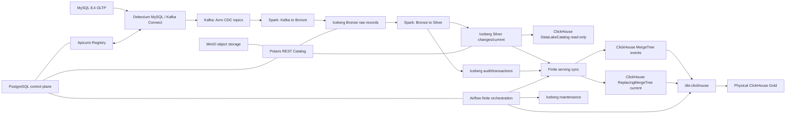

# Olist MDS: Direct Migration to MySQL, Spark Structured Streaming and Apache Iceberg

## 0. Document control

| Field | Value |
| --- | --- |
| Status | Wave 1/J1, Wave 2/J2, Stage E/V revalidation, F0, Stage L and Stage F1 are complete |
| Last updated | 2026-08-05 |
| Audited commit candidate | `400372a31dcd6cf8f37490f4bb79c93f382f2248` (accepted Stage F1 candidate) |
| Frozen baseline source | `main` commit `1400d08345ad81a0121f0ee85ee9ae81cd575a73` (frozen at Stage F0) |
| Implementation branch | `feature/mysql-spark-iceberg` |
| Evidence J1 | [docs/reports/mysql-spark-iceberg-wave1-j1-validation.md](../reports/mysql-spark-iceberg-wave1-j1-validation.md) |
| Evidence J2 | [docs/reports/mysql-spark-iceberg-wave2-j2-validation.md](../reports/mysql-spark-iceberg-wave2-j2-validation.md) |
| Evidence Stage E | [docs/reports/mysql-spark-iceberg-stage-e-validation.md](../reports/mysql-spark-iceberg-stage-e-validation.md) |
| Evidence Stage V | [docs/reports/mysql-spark-iceberg-stage-v-validation.md](../reports/mysql-spark-iceberg-stage-v-validation.md) |
| Primary audience | Implementation agents and maintainers |
| Final fixture | `tests/fixtures/olist_small/olist_small.zip` |
| Fixture SHA-256 | `5cf2ff7a104cae75d8a56cf8c6e00959894154a8d55aed2ddf0e3fa133a13976` |
| Cloud deployment | Outside the local program (see [Future GCP plan](gcp-spark-iceberg-bigquery-migration.md)) |

---

## 1. Goal and target architecture

The migration replaces the original PostgreSQL/NiFi/ClickHouse contour with a modern local Lakehouse stack:

```text
MySQL OLTP
  → Debezium MySQL / Kafka Connect
  → Kafka + Apicurio Registry (Confluent-framed Avro)
  → Spark Structured Streaming (Scala data plane)
   → Apache Iceberg on MinIO through the Polaris REST Catalog
       ├── Bronze raw Kafka records
       ├── Silver typed changes and current state
       ├── transaction and audit tables
       └── immutable reference data
  → finite ClickHouse serving sync
  → native ClickHouse MergeTree/ReplacingMergeTree
   → separate dbt-clickhouse project (Gold)
```



---

## 2. System invariants

- **MySQL** — the only authoritative OLTP database for business source data.
- **Kafka** — a time-bounded transport and replay buffer (7-day retention).
- **Iceberg** — the canonical store for Bronze, Silver, audit and reference layers.
- **ClickHouse** — a fully rebuildable serving layer.
- **PostgreSQL** — restricted exclusively to the platform control plane (Airflow, Polaris, Apicurio and `olist_control`).
- **Airflow and ClickHouse are not part of the durability path**. If they fail, transport from MySQL to Iceberg continues.

### Explicitly excluded solutions

- Running a parallel shadow PostgreSQL/MySQL database;
- Adapting NiFi for MySQL;
- Preserving or moving old Docker volumes;
- Rolling the runtime back to PostgreSQL;
- Introducing multiple inconsistent generations of `source_epoch`;
- Repeating a batch import of eight CDC tables;
- Gold tables in Iceberg;
- Streaming reads (`readStream`) from Silver tables;
- GCP/Terraform resources in the current branch.

---

## 3. Program stage status matrix

| Stage | Status | Plans and instructions | Evidence |
| --- | --- | --- | --- |
| **Wave 1 / J1** | Complete | [lakehouse/completed/wave-1-j1-runbook.md](lakehouse/completed/wave-1-j1-runbook.md) | [J1 report](../reports/mysql-spark-iceberg-wave1-j1-validation.md) |
| **Wave 2 / J2** | Complete | [lakehouse/completed/wave-2-j2-runbook.md](lakehouse/completed/wave-2-j2-runbook.md) | [J2 report](../reports/mysql-spark-iceberg-wave2-j2-validation.md) |
| **E/V / Revalidation** | **Complete** | [lakehouse/completed/stage-ev-validation-repair.md](lakehouse/completed/stage-ev-validation-repair.md) | clean `stage_v_clean_e113c55`: V0–V10 `PASS`, commit `e113c552cca990636f426b827456a77ddc9d594b`, raw evidence in `data/stage-v-evidence/stage_v_clean_e113c55/` |
| **F0 / Baseline freeze** | **Complete** | [lakehouse/completed/stage-f0-baseline-freeze.md](lakehouse/completed/stage-f0-baseline-freeze.md) | [F0 report](../reports/mysql-spark-iceberg-f0-baseline.md) |
| **L / Legacy removal + CI cutover** | **Complete** | [lakehouse/completed/stage-l-legacy-removal-ci-cutover.md](lakehouse/completed/stage-l-legacy-removal-ci-cutover.md) | [L4 report](../reports/lakehouse-stage-l4.md), clean `stage_l4_20260805_f0_restored`: V0–V10 `PASS` |
| **F1 / Final parity** | **Complete** | [lakehouse/completed/stage-f1-final-parity.md](lakehouse/completed/stage-f1-final-parity.md) + [lakehouse/contracts/final-parity.md](lakehouse/contracts/final-parity.md) | [F1 report](../reports/mysql-spark-iceberg-f1-final-parity.md); run `f1-400372a`, candidate `400372a31dcd6cf8f37490f4bb79c93f382f2248` |

Stage sequence:

```text
Wave 1 / J1 (Complete) → Wave 2 / J2 (Complete) → E/V revalidation (Complete) → F0 baseline freeze (Complete) → L cleanup + CI cutover (Complete) → F1 candidate-only parity (Complete)
```

---

## 4. Program documentation navigation

The migration documentation is divided into normative contracts, completed historical runs and active operational plans:

| Category | Document | Purpose |
| --- | --- | --- |
| **Contracts** | [architecture-and-runtime.md](lakehouse/contracts/architecture-and-runtime.md) | Target architecture, pinned component versions, Git rules and the CLI (`local_lab.py`) interface. |
| **Contracts** | [mysql-kafka-avro.md](lakehouse/contracts/mysql-kafka-avro.md) | MySQL source contract, Debezium configuration, Kafka topic inventory and Avro/Apicurio rules. |
| **Contracts** | [iceberg-data-model.md](lakehouse/contracts/iceberg-data-model.md) | Iceberg table schemas (Bronze, Silver, Audit, Reference), Polaris catalogs and MinIO buckets. |
| **Contracts** | [spark-streaming.md](lakehouse/contracts/spark-streaming.md) | Scala Spark Structured Streaming engine specification and Iceberg decode/commit algorithms. |
| **Contracts** | [serving-and-recovery.md](lakehouse/contracts/serving-and-recovery.md) | ClickHouse integration, dbt-clickhouse Gold models, Airflow procedures and failure handling. |
| **Contracts** | [validation-and-ci.md](lakehouse/contracts/validation-and-ci.md) | Automated tests, CI validation structure and safety barriers. |
| **Contracts** | [legacy-disposition-register.md](lakehouse/contracts/legacy-disposition-register.md) | L0 line-by-line decisions for workflows/scripts/tests/fixtures/secrets and deletion conditions. |
| **Contracts** | [observability.md](lakehouse/contracts/observability.md) | Producer-to-scrape-to-alert/dashboard chain for the new stack. |
| **Contracts** | [testing-and-evidence.md](lakehouse/contracts/testing-and-evidence.md) | Test ownership, transfer rules and evidence boundaries from L0 to F1. |
| **Contracts** | [final-parity.md](lakehouse/contracts/final-parity.md) | One-shot frozen F0 baseline and candidate-only F1 comparison contract. |
| **Completed** | [wave-1-j1-runbook.md](lakehouse/completed/wave-1-j1-runbook.md) | Completed historical Wave 1/J1 integration runbook. |
| **Completed** | [wave-2-j2-runbook.md](lakehouse/completed/wave-2-j2-runbook.md) | Completed historical Scala data-plane Wave 2/J2 runbook. |
| **Completed** | [stage-e-serving-integration.md](lakehouse/completed/stage-e-serving-integration.md) | Completed Stage E Serving Integration implementation plan. |
| **Completed** | [stage-v-candidate-e2e-validation.md](lakehouse/completed/stage-v-candidate-e2e-validation.md) | Completed Stage V V0–V10 plan and clean acceptance. |
| **Completed** | [stage-ev-validation-repair.md](lakehouse/completed/stage-ev-validation-repair.md) | Completed Stage E/V revalidation plan. |
| **Completed** | [serving-cutover.md](lakehouse/completed/serving-cutover.md) | Completed coordination order for E/V repair → F0 → L → F1 and transition barriers. |
| **Completed** | [stage-f0-baseline-freeze.md](lakehouse/completed/stage-f0-baseline-freeze.md) | One-shot baseline export from the exact `main` commit before cleanup. |
| **Completed** | [stage-l-legacy-removal-ci-cutover.md](lakehouse/completed/stage-l-legacy-removal-ci-cutover.md) | Completed legacy-removal and CI-cutover plan with L4 PASS evidence. |
| **Report** | [lakehouse-stage-l0-baseline.md](../reports/lakehouse-stage-l0-baseline.md) | Actual baseline rollback/E2E and L0 static findings. |
| **Report** | [lakehouse-stage-l3.md](../reports/lakehouse-stage-l3.md) | CI/workflow cutover, bounded jobs, static validation and L3 decision boundary. |
| **Completed** | [stage-f1-final-parity.md](lakehouse/completed/stage-f1-final-parity.md) | Completed candidate-only run against the frozen oracle after cleanup. |
| **Future** | [gcp-spark-iceberg-bigquery-migration.md](gcp-spark-iceberg-bigquery-migration.md) | Separate future cloud migration program for GCP/BigQuery (out of local scope). |

---

## 5. Document roles and authority order

When documents disagree, use the following order of precedence:

1. **Active contracts (`lakehouse/contracts/`)** define the current normative system behavior.
2. **The completed coordination plan (`lakehouse/completed/serving-cutover.md`)** records the order of E/V repair → F0 → L → F1 and preserves transition evidence.
3. **Detailed plans** in `lakehouse/active/` define remaining work packages, while `lakehouse/completed/` stores frozen plans for accepted stages.
4. **Validation reports (`docs/reports/`)** confirm only checks that are actually presented; a declaration without raw evidence does not close a mandatory gate.
5. **Completed runbooks (`lakehouse/completed/`)** preserve historical execution context and are not active instructions.

---

## 6. Program-wide Definition of Done

The migration is fully complete only when:

- Wave 1/J1 and Wave 2/J2 operate and are confirmed by reports;
- Stage E/V is accepted by a complete factual V0–V10 run;
- the frozen F0 baseline is exported from commit `1400d08345ad81a0121f0ee85ee9ae81cd575a73`, validated and frozen;
- legacy PostgreSQL OLTP/NiFi/Redshift runtime, old dbt/DAGs/tests/workflows are removed while control PostgreSQL is retained (Stage L);
- `.github/workflows/ci.yml` is the required common CI, the bounded component workflow runs automatically on relevant paths and full acceptance runs only manually;
- all required target CI jobs pass on the cleaned tree;
- candidate-only Stage F1 against the frozen oracle is **PASS** with no missing/extra keys or business-column mismatches;
- final evidence is tied to exact baseline/candidate commit SHAs and the fixture SHA-256.
